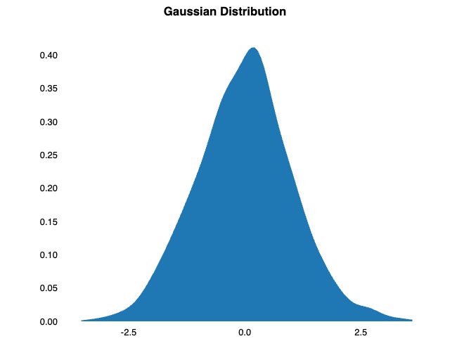

# Creating Readers, Writers and Streams

It is very common to encounter files that are compressed in various different formats
and often an annoyance to have to invoke dedicated APIs and libraries to 
read them depending on what exact format the user supplied.

Groovy NGS supports a concept of a "file like" object that can represent a file
in many different forms, from a `File` object, input stream object, or a plain path, all of which
can be compressed with gzip or bgzip or uncompressed. Many of the classes in Groovy NGS
will take an untyped "file like" argument which will be auto-detected to use the right
process to create a `Reader` or `Writer` to handle the file.

You can support similar functionality by calling the [Utils.reader](https://ssadedin.github.io/groovy-ngs-utils/doc/gngs/Utils.html#reader(def,%20Closure))
and [Utils.writer](https://ssadedin.github.io/groovy-ngs-utils/doc/gngs/Utils.html#writer(java.lang.String)) methods.

# Formatting Tables

Markdown has become a de facto standard for writing documentation and reports. One of the more tedious
aspects is formatting Markdown tables. Groovy NGS supplies a highly flexible function to format data in lists
as tables. See 

```````columns
left:
**Input**
```groovy
def data = [
    [1,2,3],
    [4,5,6]
]

Utils.table(['a','b','c'], data)
```
right:
**Output**
`````text
a | b | c
--|---|--
1 | 2 | 3
4 | 5 | 6
`````
````````


# JupyterLab Support

Groovy NGS makes an excellent addition to using Groovy within a Jupyter Notebook (or JupyterLab).

You can use any available Groovy kernel, however a 
particularly useful one is [BeakerX](https://github.com/twosigma/beakerx) which provides Groovy 
kernels out of the box along with a range of Jupyter widgets as enhancements. Together with Groovy NGS.
this makes a very effective data analysis platform for genomic data.

To further support use within BeakerX, Groovy NGS provides some additional plots. These extend the existing
BeakerX plots to provide distrubtion plots (based on kernel density estimates).

The example below shows how the Groovy NGS density plot is displayed within a Jupyter Notebook.


```````columns
left:
**Input**
```groovy
r = new Random()
data = (1..1000).collect { r.nextGaussian() }
new Plot(title: "Gaussian Distribution") << \
    new Density.Area(data:data)
```

right:
**Output**


````````

# RefGene Database Access

An enormous amount of work in human genomics requires gene definitions. Groovy NGS provides support for
loading and querying the UCSC RefGene database directly to enable access to gene and transcript definitions.

The following example shows how to create the [RefGenes](https://ssadedin.github.io/groovy-ngs-utils/doc/gngs/RefGenes.html)
class and query gene information from it:

```````columns
left:
**Input**
```groovy
refgene = new RefGenes('refGene.txt.gz')
refgene.getExons('DVL1')
```
right:
**Output**
`````text
15 regions starting at chr1:1336142-1336516
`````
````````

The [RefGenes](https://ssadedin.github.io/groovy-ngs-utils/doc/gngs/RefGenes.html) class provides a wealth of methods
for querying gene information.


Note: Support for Gencode is available in the `gngs.gencode` package. This support is functional but still under development
and less tested than the RefGene support.

